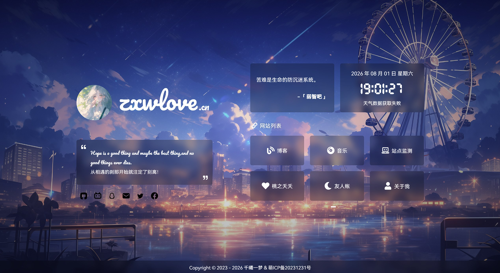

# Personal Home Page

A personal homepage / navigation site built with Vue 3 + Vite. It combines a landing page, social links, weather updates, a music player, background customization, and responsive layout for personal blogs or portfolio pages.

<p align="center">
  
</p>

## Overview

- Personal homepage and quick navigation links
- Responsive design for desktop and mobile
- Animated greetings, time display, weather info, and progress widgets
- Customizable site links, social links, and metadata
- Music player, wallpaper support, and PWA caching
- Easy static hosting on Vercel, Netlify, GitHub Pages, Docker, or Nginx

## Features

- [x] Loading animation
- [x] Site introduction and custom text
- [x] Hitokoto phrase
- [x] Date and time
- [x] Real-time weather via QWeather API
- [x] Time progress bar
- [x] APlayer music player
- [x] Mobile responsive layout
- [x] Custom wallpaper/background
- [x] Social links and site navigation configuration
- [x] PWA support with static asset caching

## Tech Stack

- [Vue 3](https://vuejs.org/)
- [Vite](https://vitejs.dev/)
- [Pinia](https://pinia.vuejs.org/)
- [Element Plus](https://element-plus.org/)
- [Aplayer](https://aplayer.js.org/)
- [IconPark](https://iconpark.oceanengine.com/official)
- [xicons](https://xicons.org/)

## Project Structure

```text
.
├── public/                     # Static assets, icons, backgrounds
├── src/
│   ├── api/                   # API requests
│   ├── assets/                # JSON config and static resources
│   ├── components/            # Reusable UI components
│   ├── store/                 # Pinia state
│   ├── style/                 # Global styles
│   ├── utils/                 # Utility functions
│   ├── views/                 # View pages
│   ├── App.vue                # Root component
│   └── main.js                # Entry file
├── .env                       # Environment variables
├── Dockerfile                 # Container build config
├── package.json               # Scripts and dependencies
├── vite.config.js             # Vite config
├── README.md                  # Chinese docs
├── README_EN.md               # English docs
├── screenshots/               # Screenshot assets
└── dist/                      # Build output
```

## Quick Start

### 1. Install dependencies

Requirements: Node.js >= 18, recommend pnpm.

```bash
npm install -g pnpm
pnpm install
```

### 2. Run in development mode

```bash
pnpm dev
```

The Vite dev server runs on `http://localhost:3000` by default.

### 3. Build for production

```bash
pnpm build
```

The static output is generated in the `dist/` directory and can be deployed directly.

## Environment Variables

The project includes a `.env` file. Update the following values as needed:

```bash
# Site information
VITE_SITE_NAME = "浅小兮の梦"
VITE_SITE_ANTHOR = "千曦一梦"
VITE_SITE_KEYWORDS = "千曦一梦&浅小兮,personal homepage"
VITE_SITE_DES = "Welcome to my homepage"
VITE_SITE_URL = "https://your-domain.com"
VITE_SITE_LOGO = "/images/favicon.ico"
VITE_SITE_MAIN_LOGO = "/images/logo.png"
VITE_SITE_APPLE_LOGO = "/images/logo.png"

# Intro text
VITE_DESC_HELLO = "Hope is a good thing and maybe the best thing, and no good things ever dies."
VITE_DESC_TEXT = "From the moment we met, parting was already destined."
VITE_DESC_HELLO_OTHER = "Oops !"
VITE_DESC_TEXT_OTHER = "You found it again. Click once more to close it."

# Weather
VITE_WEATHER_KEY = "your_qweather_key"
VITE_SENIVERSE_KEY = "your_seniverse_key"   # optional fallback service

# Site metadata
VITE_SITE_START = "2023-12-31"
VITE_SITE_ICP = "ICP No. 20231231"

# Music player
VITE_SONG_API = "https://meting-api.saop.cc/api"
VITE_SONG_SERVER = "netease"
VITE_SONG_TYPE = "playlist"
VITE_SONG_ID = "5314875708"
VITE_SONG_ID_QQ = "1171747653"

# Wallpaper
VITE_CUSTOM_COVER_URL = "https://example.com/cover.mp4"
VITE_CUSTOM_API_URL = "https://api.example.com/wallpaper"
```

Notes:

- `VITE_WEATHER_KEY` should be obtained from [QWeather Developer Service](https://dev.qweather.com/docs/api/) for city lookup and current weather data
- `VITE_SENIVERSE_KEY` is a fallback weather provider and can be left empty if you do not need it
- `VITE_SONG_API` is best served via your own Meting API deployment; public instances may be rate-limited
- If you do not need weather, music, or ICP info, set the related variables to empty values

## Customization

### 1. Site links

Edit `src/assets/siteLinks.json` to customize your navigation links:

```json
[
  {
    "icon": "Blog",
    "name": "Blog",
    "link": "https://example.com/blog"
  }
]
```

The icon names can be extended in the component logic and mapped from `@vicons/*` icons.

### 2. Social links

Edit `src/assets/socialLinks.json` to customize social profiles:

```json
[
  {
    "name": "Github",
    "icon": "ri-github-fill",
    "tip": "Check my GitHub",
    "url": "https://github.com/your-name"
  }
]
```

### 3. Background and branding

- Background images: `public/images/`
- Site icons: `public/images/icon/`
- Replace the default assets or update the implementation in the corresponding Vue components

## Deployment

### Manual deployment

```bash
pnpm install
pnpm build
```

Upload the generated files in `dist/` to a static host such as Nginx, Apache, or an object-storage CDN.

### Docker deployment

```bash
docker build -t home .
docker run -p 12445:12445 -d home
```

Then open: `http://localhost:12445`

### Vercel / Netlify

1. Connect your GitHub repository
2. Use the default static framework settings or Vite
3. Set build command to `pnpm build`
4. Set publish directory to `dist`
5. Deploy and open the generated domain

## API references

- [QWeather Developer Service](https://dev.qweather.com/docs/api/)
- [Meting API](https://github.com/xizeyoupan/Meting-API)
- [Hitokoto](https://hitokoto.cn/)
- [Seniverse Weather](https://seniverse.com/)

## License

This project is licensed under the MIT License. See [LICENSE](./LICENSE) for details.

## Notes

> For font changes, wallpaper adjustments, or new sections, check the files under `src/assets`, `src/components`, and `src/views` first.
> Since the project depends on third-party APIs and external resources, validate your API keys and access permissions before deployment.

